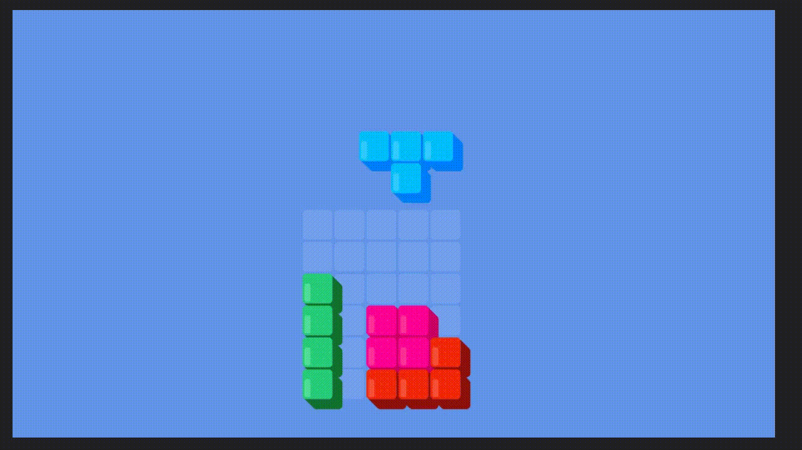

# React-tetris!

A minimalist tetris game made with React.js.

## How to play

You can play it here:
The rules are...

## Project description

I made this game primarily to study Redux and Error throw. Although it has some code smells, it is generally well made, and more importantly for a game: has great time sessions and replays rate. Its main features are:

- Rudimentar AI balancement
- Redux for state management
- Errors for triggers
- Modular architecture of piece and blocks
- Pseudo 3d visuals and VFX

## Installation Instructions

The project uses this base TS React template with linting and more:

## Contact and license
